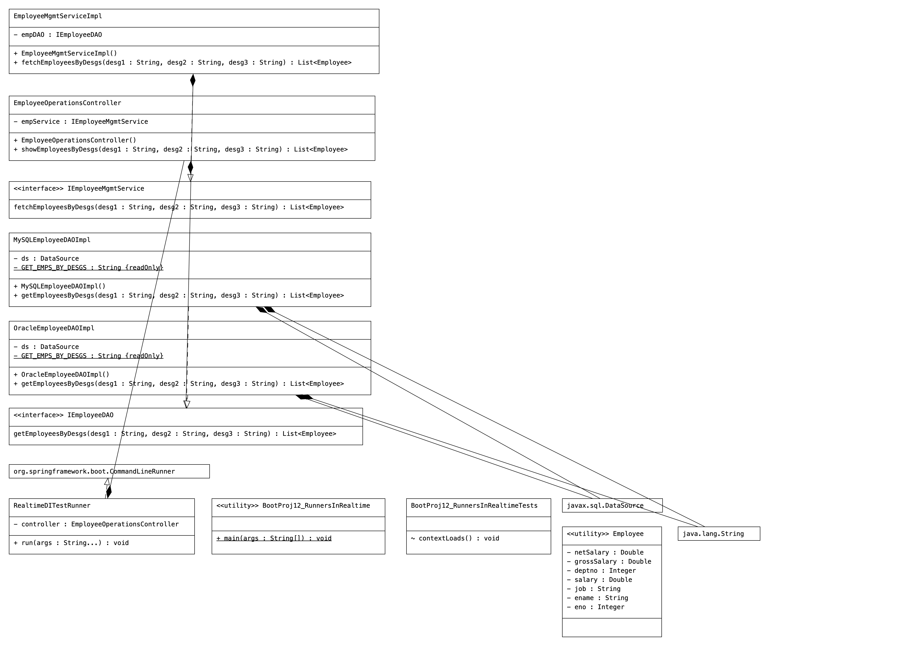

# Code
```Java
package com.employee;

import org.springframework.boot.SpringApplication;
import org.springframework.boot.autoconfigure.SpringBootApplication;
import org.springframework.boot.autoconfigure.jdbc.JdbcTemplateAutoConfiguration;

@SpringBootApplication(exclude = JdbcTemplateAutoConfiguration.class)
public class BootProj12_RunnersInRealtime {
	
    public static void main(String[] args) {
        //get  IOC container
        SpringApplication.run(BootProj12_RunnersInRealtime.class, args);


    }

}

```

```Java
package com.employee.controller;

import java.util.List;

import org.springframework.beans.factory.annotation.Autowired;
import org.springframework.stereotype.Controller;

import com.employee.model.Employee;
import com.employee.service.IEmployeeMgmtService;

@Controller("empController")
public class EmployeeOperationsController {
	@Autowired
	private IEmployeeMgmtService  empService;
	
	public EmployeeOperationsController() {
		System.out.println("EmployeeOperationsController:: 0-param constructor");
	}
	
	
	public   List<Employee>   showEmployeesByDesgs(String desg1,String desg2,String desg3)throws Exception{
		//use service
		List<Employee> list=empService.fetchEmployeesByDesgs(desg1, desg2, desg3);
		return list;
	}

}

```

```Java
package com.employee.dao;

import java.util.List;

import com.employee.model.Employee;

public interface IEmployeeDAO {
   public List<Employee>   getEmployeesByDesgs(String desg1,String desg2,String desg3)throws Exception;
}

```

```Java
package com.employee.dao;

import java.sql.Connection;
import java.sql.PreparedStatement;
import java.sql.ResultSet;
import java.sql.SQLException;
import java.util.ArrayList;
import java.util.List;

import javax.sql.DataSource;

import org.springframework.beans.factory.annotation.Autowired;
import org.springframework.context.annotation.Profile;
import org.springframework.stereotype.Repository;

import com.employee.model.Employee;

@Repository("mysqlEmpDAO")
@Profile({"dev","test"})
public class MySQLEmployeeDAOImpl implements IEmployeeDAO {
	private  static final String GET_EMPS_BY_DESGS="SELECT EMPNO,ENAME,DESG,SAL,DEPTNO FROM EMPLOYEE_TAB WHERE DESG IN(?,?,?) ORDER BY DESG ";
	@Autowired
	private  DataSource  ds;

	public MySQLEmployeeDAOImpl() {
		System.out.println("MySQLEmployeeDAOImpl:: 0-param constructor");
	}

	@Override
	public List<Employee> getEmployeesByDesgs(String desg1, String desg2, String desg3) throws Exception {
		System.out.println("EmployeeDAOImpl.getEmployeesByDesgs()::: DAtaSource obj class name::"+ds.getClass());
             List<Employee> list=null;
      try(//get  pooled connectoon from the  DataSource
    		    Connection con=ds.getConnection();
    		   //create PreparedStatemetn object  using the  con obj
    		   PreparedStatement ps=con.prepareStatement(GET_EMPS_BY_DESGS);
    		    ){  //try with resource
    	       //set  method args  as the  query param values
    	      ps.setString(1,desg1);  ps.setString(2,desg2); ps.setString(3, desg3);
    	     try(// execute  the SQL Query
    	    		 ResultSet rs=ps.executeQuery();
    	    		 ){   //nested try with resource
    	    	   // initialize the ArrayList
    	    	 list=new ArrayList();	
    	    	 //process the ResultSet to copy its  recods  List<Employee> obj  as the Employee objs
    	    	 while(rs.next()) {
    	    		 // copy each record  to Employee class obj
    	    		 Employee  emp=new Employee();
    	    		 emp.setEno(rs.getInt(1));
    	    		 emp.setEname(rs.getString(2));
    	    		 emp.setJob(rs.getString(3));
    	    		 emp.setSalary(rs.getDouble(4));
    	    		 emp.setDeptno(rs.getInt(5));
    	    		//add Employee class obj to List Colelction
    	    		 list.add(emp);
    	    	 }//while
    	     }//try2
      }//try
      catch(SQLException se) {  //for handling known exeception
    	  se.printStackTrace();
    	  throw se; // Exeption rethrowing for Exception Propagration
      }
      catch(Exception e) {  //for handling  unknown exception
    	   e.printStackTrace();
    	   throw e;
      }
		return list;
	}//method

}//class

```

```Java
package com.employee.dao;

import java.sql.Connection;
import java.sql.PreparedStatement;
import java.sql.ResultSet;
import java.sql.SQLException;
import java.util.ArrayList;
import java.util.List;

import javax.sql.DataSource;

import org.springframework.beans.factory.annotation.Autowired;
import org.springframework.context.annotation.Profile;
import org.springframework.stereotype.Repository;

import com.employee.model.Employee;

@Repository("orampDAO")
@Profile({"uat","prod"})
public class OracleEmployeeDAOImpl implements IEmployeeDAO {
	private  static final String GET_EMPS_BY_DESGS="SELECT EMPNO,ENAME,JOB,SAL,DEPTNO FROM EMP WHERE JOB IN(?,?,?) ORDER BY JOB ";
	@Autowired
	private  DataSource  ds;
	
	public OracleEmployeeDAOImpl() {
		System.out.println("OracleEmployeeDAOImpl:: 0-param constructor");
	}

	@Override
	public List<Employee> getEmployeesByDesgs(String desg1, String desg2, String desg3) throws Exception {
		System.out.println("EmployeeDAOImpl.getEmployeesByDesgs()::: DAtaSource obj class name::"+ds.getClass());
             List<Employee> list=null;
      try(//get  pooled connectoon from the  DataSource
    		    Connection con=ds.getConnection();
    		   //create PreparedStatemetn object  using the  con obj
    		   PreparedStatement ps=con.prepareStatement(GET_EMPS_BY_DESGS);
    		    ){  //try with resource
    	       //set  method args  as the  query param values
    	      ps.setString(1,desg1);  ps.setString(2,desg2); ps.setString(3, desg3);
    	     try(// execute  the SQL Query
    	    		 ResultSet rs=ps.executeQuery();
    	    		 ){   //nested try with resource
    	    	   // initialize the ArrayList
    	    	 list=new ArrayList();	
    	    	 //process the ResultSet to copy its  recods  List<Employee> obj  as the Employee objs
    	    	 while(rs.next()) {
    	    		 // copy each record  to Employee class obj
    	    		 Employee  emp=new Employee();
    	    		 emp.setEno(rs.getInt(1));
    	    		 emp.setEname(rs.getString(2));
    	    		 emp.setJob(rs.getString(3));
    	    		 emp.setSalary(rs.getDouble(4));
    	    		 emp.setDeptno(rs.getInt(5));
    	    		//add Employee class obj to List Colelction
    	    		 list.add(emp);
    	    	 }//while
    	     }//try2
      }//try
      catch(SQLException se) {  //for handling known exeception
    	  se.printStackTrace();
    	  throw se; // Exeption rethrowing for Exception Propagration
      }
      catch(Exception e) {  //for handling  unknown exception
    	   e.printStackTrace();
    	   throw e;
      }
		return list;
	}//method

}//class

```

```Java
package com.employee.model;

import lombok.Data;

@Data
public class Employee {
	//bean properties
	private Integer eno;
	private String  ename;
	private  String job;
	private  Double salary;
	private  Integer deptno;
	private  Double grossSalary;
	private  Double netSalary;

}

```
```Java
package com.employee.runners;

import java.util.List;

import org.springframework.beans.factory.annotation.Autowired;
import org.springframework.boot.CommandLineRunner;
import org.springframework.stereotype.Component;

import com.employee.controller.EmployeeOperationsController;
import com.employee.model.Employee;

@Component
public class RealtimeDITestRunner  implements CommandLineRunner {
	@Autowired
	private  EmployeeOperationsController  controller;

	@Override
	public void run(String... args) throws Exception {
		System.out.println("RealtimeDITestRunner.run()");
		//invoke the b.method
		List<Employee> list=controller.showEmployeesByDesgs("MANAGER", "SALESMAN", "CLERK");
		list.forEach(emp->{
			System.out.println(emp);
		});
		
	}

}

```

```Java
package com.employee.service;

import java.util.List;

import org.springframework.beans.factory.annotation.Autowired;
import org.springframework.stereotype.Service;

import com.employee.dao.IEmployeeDAO;
import com.employee.model.Employee;

@Service("empService")
public class EmployeeMgmtServiceImpl implements IEmployeeMgmtService {
	@Autowired
	private IEmployeeDAO  empDAO;
	
	public EmployeeMgmtServiceImpl() {
		System.out.println("EmployeeMgmtServiceImpl:: 0-param cosntructor");
	}

	@Override
	public List<Employee> fetchEmployeesByDesgs(String desg1, String desg2, String desg3) throws Exception {
		//use DAO
		List<Employee> list=empDAO.getEmployeesByDesgs(desg1, desg2, desg3);
		list.forEach(emp->{
			  //b.logic  to calculate the grossSalary and netSalary
			emp.setGrossSalary(emp.getSalary()+(emp.getSalary()*0.4));
			emp.setNetSalary(emp.getGrossSalary()-(emp.getGrossSalary()*0.2));
		});
		
		return list;
	}

}

```

```Java
package com.employee.service;

import java.util.List;

import com.employee.model.Employee;

public interface IEmployeeMgmtService {
    public  List<Employee>   fetchEmployeesByDesgs(String desg1,String desg2,String desg3)throws Exception;
}

```

```yaml
spring:
  profiles:
    active: prod
---
spring: 
   config: 
      activate: 
          on-profile: dev
           
   datasource:
     dbcp2:
        max-total: 10
        min-idle: 10
     driver-class-name: com.mysql.cj.jdbc.Driver
     password: root
     type: org.apache.commons.dbcp2.BasicDataSource
     url: jdbc:mysql:///NTSPBMS911DB
     username: root       
---

spring: 
   config: 
      activate: 
          on-profile: test
   datasource:
      driver-class-name: com.mysql.cj.jdbc.Driver
      password: root
      type: com.mchange.v2.c3p0.ComboPooledDataSource
      url: jdbc:mysql:///NTSPBMS911DB
      username: root
---
spring: 
   config: 
      activate: 
          on-profile: uat
   datasource:
     driver-class-name: oracle.jdbc.driver.OracleDriver
     password: manager
     type: oracle.ucp.jdbc.PoolDataSourceImpl
     url: jdbc:oracle:thin:@localhost:1521:xe
     username: system       
---
spring: 
   config: 
      activate: 
          on-profile: prod
   datasource:
    driver-class-name: oracle.jdbc.driver.OracleDriver
    password: manager
    url: jdbc:oracle:thin:@localhost:1521:xe
    username: system

```

# Dependencies

```xml
 <dependencies>
        <dependency>
            <groupId>org.springframework.boot</groupId>
            <artifactId>spring-boot-starter-jdbc</artifactId>
            <!--	<exclusions>
                    <exclusion>
                        <groupId>com.zaxxer</groupId>
                        <artifactId>HikariCP</artifactId>
                    </exclusion>
                </exclusions>-->
        </dependency>

        <!-- https://mvnrepository.com/artifact/com.oracle.database.jdbc/ucp -->
        <dependency>
            <groupId>com.oracle.database.jdbc</groupId>
            <artifactId>ucp</artifactId>
        </dependency>

		
        <!--		 https://mvnrepository.com/artifact/org.apache.commons/commons-dbcp2 -->
        <dependency>
            <groupId>org.apache.commons</groupId>
            <artifactId>commons-dbcp2</artifactId>
        </dependency>


        <!-- https://mvnrepository.com/artifact/org.apache.tomcat/tomcat-jdbc -->
        <dependency>
            <groupId>org.apache.tomcat</groupId>
            <artifactId>tomcat-jdbc</artifactId>
        </dependency>


        <!-- https://mvnrepository.com/artifact/com.mchange/c3p0 -->
        <dependency>
            <groupId>com.mchange</groupId>
            <artifactId>c3p0</artifactId>
            <version>0.10.0</version>
        </dependency>


        <dependency>
            <groupId>com.oracle.database.jdbc</groupId>
            <artifactId>ojdbc11</artifactId>
            <scope>runtime</scope>
        </dependency>
        <dependency>
            <groupId>org.projectlombok</groupId>
            <artifactId>lombok</artifactId>
            <optional>true</optional>
        </dependency>
        <dependency>
            <groupId>org.springframework.boot</groupId>
            <artifactId>spring-boot-starter-test</artifactId>
            <scope>test</scope>
        </dependency>
        <dependency>
            <groupId>org.springframework.boot</groupId>
            <artifactId>spring-boot-starter</artifactId>
        </dependency>
        <dependency>
            <groupId>com.mysql</groupId>
            <artifactId>mysql-connector-j</artifactId>
            <scope>runtime</scope>
        </dependency>
    </dependencies>

```

# UML
